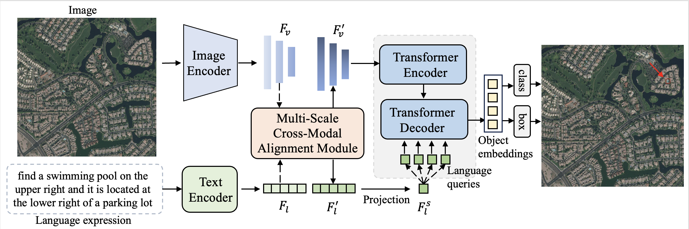

The official implementation of LQVG.

<h1>
<b>
Language Query based Transformer with Multi-Scale Cross-Modal Alignment for Visual Grounding on Remote Sensing Images
<!-- Language as Queries for Referring   Video Object Segmentation -->
</b>
</h1>

> Meng Lan, Fu Rong, Hongzan Jiao, Zhi Gao, Lefei Zhang

<!-- > **Bidirectional Correlation-Driven Inter-Frame Interaction Transformer for Referring Video Object Segmentation**
>
> Meng Lan, Fu Rong, Zuchao Li, Wei Yu, Lefei Zhang -->

### Abstract

Visual grounding for remote sensing images (RSVG) aims to localize the referred objects in the remote sensing (RS) images according to a language expression. Existing methods tend to align visual and linguistic features followed by concatenation and then employ a fusion Transformer to learn a token rep- resentation for final target localization. However, simple fusion Transformer structure fails to sufficiently learn the location rep- resentation of the referred object from the multi-modal features. Inspired by the detection Transformer, in this paper, we propose a novel language query based Transformer framework for RSVG termed LQVG. Specifically, we adopt the extracted sentence- level linguistic features as the queries, called language queries, to retrieve and aggregate representation information of the referred object from the multi-scale visual features in the Transformer decoder. The language queries are then converted into object embeddings for final coordinate prediction of the referred object. Besides, a multi-scale cross-modal alignment module is devised before the multimodal Transformer to align the semantics and enhance the correlation between the visual and linguistic features, thus facilitating the cross-modal decoding process to generate more precise object representation. Moreover, a new RSVG dataset named RSVG-HR is built to evaluated the performance of the RSVG approaches on very high-resolution remote sensing images with inconspicuous objects. Experimental results on two benchmark datasets demonstrate that our proposed method significantly surpasses the comparison methods and achieves state-of-the-art performance.

## Requirements

We test the codes in the following environments, other versions may also be compatible:

- CUDA 11.1
- Python 3.7
- Pytorch 1.8.1

## Data Preparation

We build the RSVG-HR dataset based on the RSVG dataset, please download the images from [Here](https://sunyuxi.github.io/publication/GeoVG), and our annotations are provided in 'RSVG-HR/Annotations' folder.